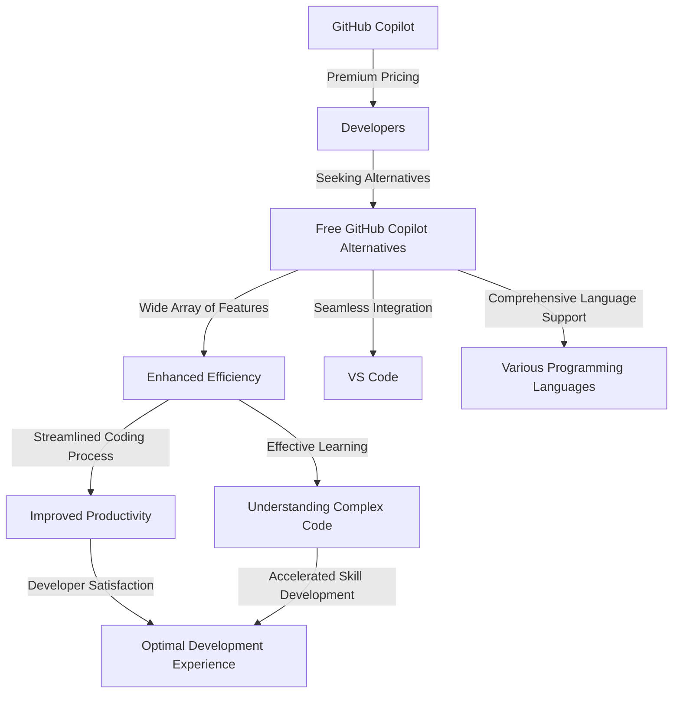

# 10 Superior GitHub Copilot Alternatives for VS Code in 2024

In the dynamic world of coding, developers are perpetually in search of tools that can enhance their coding efficiency. GitHub Copilot has indeed been a revolutionary tool in this aspect. However, its premium pricing might not be appealing to all. The good news is, there are numerous free alternatives that offer similar functionality. In this comprehensive guide, we delve into 10 of the most compelling free GitHub Copilot alternatives tailor-made for Visual Studio Code in the year 2024.

## Comparative Analysis of Free GitHub Copilot Alternatives

Before we delve into the details of each alternative, let's conduct a comparative overview of their key features:

| Tool               | Language Support                                                                                                                                                                           | Auto-Completion | Code Generation | Code Explanation |
|--------------------|--------------------------------------------------------------------------------------------------------------------------------------------------------------------------------------------|-----------------|-----------------|------------------|
| Bito               | Python, JavaScript, TypeScript, Java, C#, C++, Go, Ruby, PHP, Swift, Kotlin, Rust, Scala                                                                                                  | ✓               | ✓               | ✓                |
| Tabnine            | Python, JavaScript, TypeScript, Java, C#, C++, Go, Ruby, PHP, Swift, Kotlin, Rust, Scala                                                                                                 | ✓               | ✓               | ✗                |
| Amazon CodeWhisperer | Python, JavaScript, TypeScript, Java, C#, C++, Go, Ruby, PHP                                                                                                                               | ✓               | ✓               | ✗                |
| Codeium            | Python, JavaScript, TypeScript, Java, C#, C++, Go, Ruby, PHP, Swift, Kotlin, Rust, Scala                                                                                                  | ✓               | ✓               | ✓                |
| Cody               | Python, JavaScript, TypeScript, Java, C#, C++, Go, Ruby, PHP, Swift, Kotlin, Rust, Scala                                                                                                  | ✓               | ✓               | ✗                |
| FauxPilot          | Python, JavaScript, TypeScript, Java, C#, C++, Go, Ruby, PHP, Swift, Kotlin, Rust, Scala                                                                                                  | ✓               | ✓               | ✗                |
| Tabby              | Python, JavaScript, TypeScript, Java, C#, C++, Go, Ruby, PHP, Swift, Kotlin, Rust, Scala                                                                                                  | ✓               | ✓               | ✗                |
| CodeGeeX           | Python, JavaScript, TypeScript, Java, C#, C++, Go, Ruby, PHP, Swift, Kotlin, Rust, Scala                                                                                                  | ✓               | ✓               | ✗                |
| AskCodi            | Python, JavaScript, TypeScript, Java, C#, C++, Go, Ruby, PHP, Swift, Kotlin, Rust, Scala                                                                                                  | ✓               | ✓               | ✓                |
| Blackbox AI        | Python, JavaScript, TypeScript, Java, C#, C++, Go, Ruby, PHP, Swift, Kotlin, Rust, Scala                                                                                                  | ✓               | ✓               | ✗                |

## In-depth Exploration of Top Alternatives

### 1. Bito

Bito emerges as an AI-powered code assistant offering auto-completion, code generation, and code explanation features. With support for a wide array of programming languages including Python, JavaScript, TypeScript, Java, and more, Bito integrates seamlessly with VS Code. Its intuitive user interface coupled with comprehensive language support makes it a formidable choice for developers.

### 2. Tabnine

Tabnine stands out as a popular code completion tool leveraging machine learning to deliver intelligent auto-completion suggestions. While it lacks code explanation capabilities, Tabnine excels in accuracy, significantly expediting the coding process. Its compatibility across various programming languages and seamless integration with VS Code solidify its position as a top contender among GitHub Copilot alternatives.

### 3. Amazon CodeWhisperer

Recently unveiled by Amazon Web Services (AWS), CodeWhisperer emerges as a promising AI-powered code completion and generation tool. Tailored for Python, JavaScript, TypeScript, Java, and more, CodeWhisperer offers auto-completion and code generation functionalities. Notably, its availability as a free resource for AWS customers renders it an enticing option for developers entrenched in AWS services.

### 4. Codeium

Codeium emerges as a versatile AI-powered coding assistant encompassing auto-completion, code generation, and code explanation capabilities. Supporting an extensive spectrum of programming languages, Codeium seamlessly integrates with VS Code through an extension. Its prowess in elucidating complex code snippets positions it as an invaluable asset for both seasoned developers and novices alike.

### 5. Cody

Cody presents itself as a reliable and open-source code completion tool harnessing machine learning for intelligent auto-completion suggestions. While lacking in code generation or explanation functionalities, Cody's simplicity and efficiency make it a commendable choice for developers seeking streamlined coding experiences.

## Conclusion

In the realm of coding, efficiency reigns supreme. With an array of free alternatives to GitHub Copilot at your disposal, elevating your coding prowess has never been more attainable. Whether you prioritize auto-completion, code generation, or comprehensive code explanation, rest assured, there exists a perfect fit for your needs. Embrace the future of coding with these stellar GitHub Copilot alternatives and revolutionize your development journey today!

Unleash the full potential of your coding endeavors with these remarkable alternatives!
